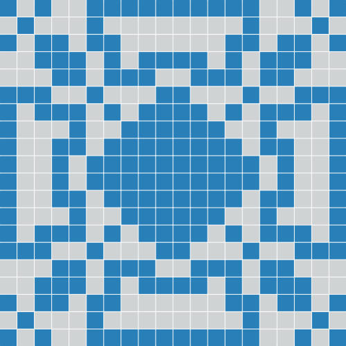

# Java Lights Out Solver
## Examples
### Example 1
<table>
  <tr><th>Start grid<br>(4×4)</th><th>Pattern<br>(Classic)</th><th>:arrow_right:</th><th>Final grid<br>(4×4)</th></tr>
  <tr>
    <td></td>
    <td></td>
    <td></td>
    <td></td>
  </tr>
</table>

```java
GridInterface startGrid = Utils.getEmptyGrid(4, 4);
GridInterface finalGrid = Utils.getFullGrid(4, 4);
PatternInterface pattern = Utils.getClassicPattern();

Solver solver = new Solver(startGrid, finalGrid, pattern);
// compute all solutions
Solutions solutions = solver.solve();

System.out.println(solutions);
```

<table>
  <tr><th colspan='8'>Solutions</th></tr>
  <tr>
    <td></td>
    <td></td>
    <td></td>
    <td></td>
    <td></td>
    <td></td>
    <td></td>
    <td></td>
  </tr>
  <tr>
    <td></td>
    <td></td>
    <td></td>
    <td></td>
    <td></td>
    <td></td>
    <td></td>
    <td></td>
  </tr>
</table>

### Example 2
<table>
  <tr><th>Start grid<br>(20×20)</th><th>Pattern<br>(Classic)</th><th>:arrow_right:</th><th>Final grid<br>(20×20)</th></tr>
  <tr>
    <td></td>
    <td></td>
    <td></td>
    <td></td>
  </tr>
</table>

```java
GridInterface startGrid = Utils.getEmptyGrid(20, 20);
GridInterface finalGrid = Utils.getFullGrid(20, 20);
PatternInterface pattern = Utils.getClassicPattern();

Solver solver = new Solver(startGrid, finalGrid, pattern);
// compute only the first one solution (if exists)
Optional<Solution> firstSolution = solver.findFirstSolution();

System.out.println(firstSolution);
```

<table>
  <tr><th>First solution</th></tr>
  <tr>
    <td align="center"></td>
  </tr>
</table>
