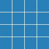

# Java Lights Out Solver
## Examples
### Example 1
Start grid | Pattern | :arrow_right: | Final grid
-----------|---------|---|-----------
 |  |  | 

```java
GridInterface startGrid = Utils.getEmptyGrid(4, 4);
GridInterface finalGrid = Utils.getFullGrid(4, 4);
PatternInterface pattern = Utils.getClassicPattern();

Solver solver = new Solver(startGrid, finalGrid, pattern);
Solutions solutions = solver.solve();

System.out.println(solutions);
```
